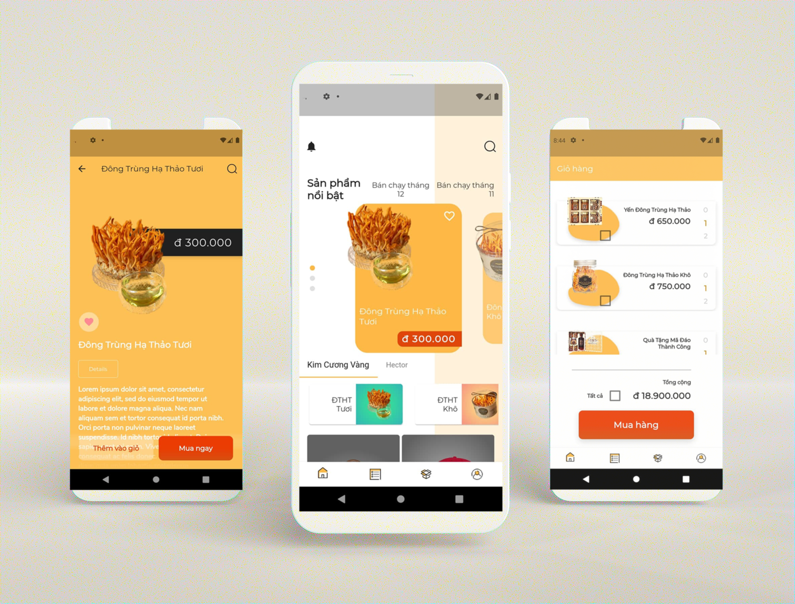

I have customized the e-commerce app:
<ul>
	<li>Vietnameseize the application by changing the display text to suit Vietnamese; adjust the price format in VND</li>
	<li>In the Product screen, sticky the Tabbar to the top position when scrolling the Product list; crop each transparent image</li>
	<li>In the Product details screen, change the display of Add to Cart and Buy Now button</li>
	<li>In the Shopping Cart screen, change the display of the Total Payment information and Buy Button</li>
</ul>

Original source: <a href="https://github.com/robertodevs/flutter_ecommerce_template">https://github.com/robertodevs/flutter_ecommerce_template</a>
